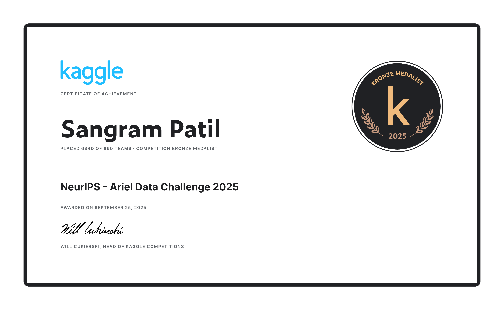
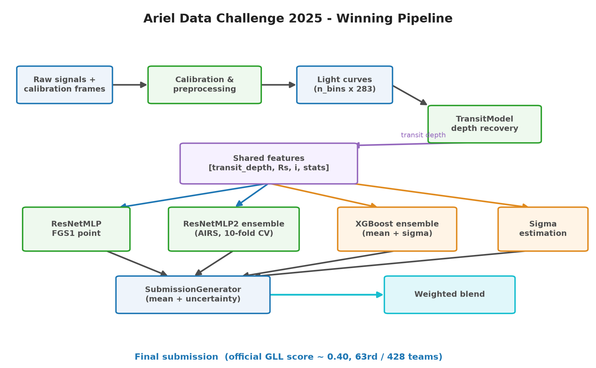
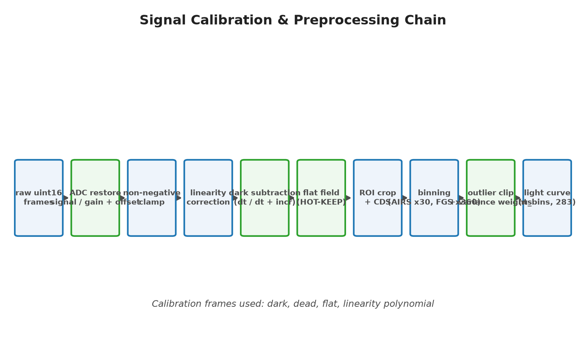
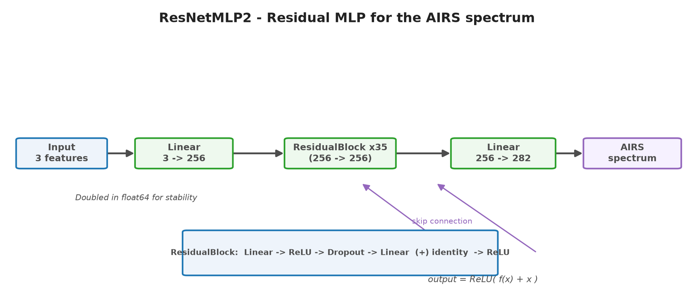
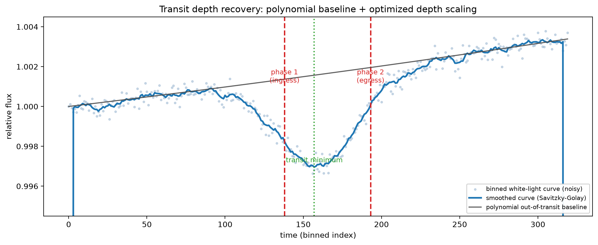
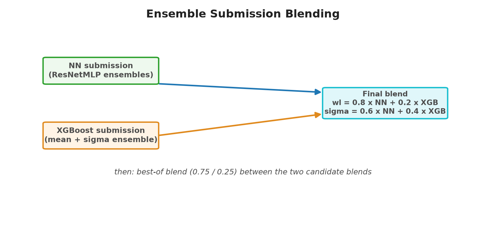

# Ariel Data Challenge 2025 — Exoplanet Spectrum Recovery

[](https://www.python.org/downloads/)
[](LICENSE)
[](https://www.kaggle.com/competitions/ariel-data-challenge-2025)

## Certificate

Kaggle verified certificate for the competition:



[View the certificate on Kaggle](https://www.kaggle.com/certification/competitions/sangrampatil5150/ariel-data-challenge-2025)


**63rd place · Bronze medal** — recover the ground-truth spectra of exoplanets from
noisy simulated observations of the European Space Agency's **Ariel** mission.

| | |
| --- | --- |
| Competition | [Ariel Data Challenge 2025 (NeurIPS)](https://www.kaggle.com/competitions/ariel-data-challenge-2025) |
| Certificate | [Kaggle competition certificate](https://www.kaggle.com/certification/competitions/sangrampatil5150/ariel-data-challenge-2025) |

A clean, re-structured implementation of the full winning pipeline: raw telescope
signal calibration → physically-motivated transit depth recovery → neural-network
and gradient-boosting spectrum predictors → learned uncertainty calibration →
weighted ensemble blending.

---

## Table of contents

- [Overview](#overview)
- [The challenge](#the-challenge)
- [Approach](#approach)
- [Architecture](#architecture)
- [Diagrams & assets](#diagrams--assets)
- [Certificate](#certificate)
- [Repository structure](#repository-structure)
- [Getting started](#getting-started)
- [Reproducing the submission](#reproducing-the-submission)
- [Key ideas & results](#key-ideas--results)
- [What I would try next](#what-i-would-try-next)
- [License](#license)

## Overview

When an exoplanet passes in front of its host star, a tiny fraction of the
starlight filters through the planet's atmosphere. Analyzing this *transit
spectroscopy* signal lets astronomers determine atmospheric composition — but
the signal is buried under complex, time-dependent instrumental and stellar
noise. The competition asks you to recover the true spectrum from simulated
Ariel observations of ~1,100 exoplanets, scored with a **Gaussian
Log-Likelihood (GLL)** metric that rewards both accurate spectra and
well-calibrated uncertainties.

## The challenge

| Item | Details |
| --- | --- |
| Dataset | Simulated ESA/Ariel observations: FGS1 (0.60–0.80 um) and AIRS-CH0 (1.95–3.90 um) time-series imagery + calibration frames |
| Target | 283-point transmission spectrum per planet (1 FGS1 point + 282 AIRS bins) |
| Metric | Gaussian Log-Likelihood normalized between a naive and an ideal predictor, clipped to [0, 1] |
| Evaluation | Sum of GLL across all wavelengths and planets; FGS1 channel weighted ~58x |
| Result | **63rd / 428 teams · Bronze medal · ~0.40 GLL** |

The key challenge is that the metric couples two things: an accurate **mean**
spectrum and a calibrated **uncertainty** per wavelength. The FGS1 channel
carries disproportionate weight, so both predictors and uncertainties need to be
treated separately per instrument.

## Approach

The solution is a two-model ensemble where each model attacks the problem from a
different angle, plus a signal-processing front-end shared by both:

### 1. Signal calibration & preprocessing

Raw uint16 detector counts are restored to physical flux:

1. **ADC restore** — `signal / gain + offset`
2. **Non-negative clamp**
3. **Linearity correction** — Horner evaluation of a per-pixel polynomial
4. **Dark subtraction** — respecting the alternating integration-time pattern
   (`dt` / `dt + increment` for even/odd frames)
5. **Flat-field correction** — dead pixels masked, hot pixels deliberately kept
   (HOT-KEEP policy)
6. **ROI crop** → correlated double sampling → **binning** (30x for AIRS, 360x
   for FGS1) → robust clipping → per-wavelength inverse-variance weighting

This produces a compact light curve per planet: `(n_bins, 283)` where column 0
is FGS1 and columns 1–282 are AIRS spectral bins.

### 2. Physically-motivated transit depth (shared)

Instead of feeding raw flux to a regressor, the white-light curve is modeled
explicitly:

- detect ingress/egress phases on a smoothed light curve,
- fit a low-order polynomial baseline to the out-of-transit segments,
- **Nelder–Mead optimization** over the scalar transit depth `s` that best joins
  the three segments into a smooth curve.

The recovered depth (scaled by an empirically calibrated factor) becomes the
first feature for both downstream predictors.

### 3. Neural-network predictor (spectra from meta-features)

Residual MLPs map the compact feature vector `[transit_depth, Rs, i]` to spectra:

- `ResNetMLP` — predicts the single **FGS1** point.
- `ResNetMLP2` — predicts the full **282-bin AIRS spectrum**; the final
  prediction averages several **10-fold CV ensembles** trained on different
  feature sets (`[transit_depth, Rs, i]`, `[transit_depth, Rs, i, P]`, and the
  full 9-column feature set) and architectures.

### 4. XGBoost predictor (rich feature engineering)

A gradient-boosting ensemble consuming a much richer feature matrix:

- aperture-photometry light curves for both instruments,
- depth, SNR, detrended skew/kurtosis, noise autocorrelation per visit,
- physics-informed features (impact parameter, transit duration, ingress time,
  equilibrium temperature, gravity proxy, ...),
- pairwise polynomial interactions of the stellar metadata.

Two multi-output XGBoost heads are trained per fold: a **mean** model and a
**sigma** model that regresses the mean model's absolute residuals (a learned
heteroscedastic uncertainty).

### 5. Uncertainty calibration

Because the GLL metric rewards calibrated uncertainties, per-planet noise is
estimated from the out-of-transit vs in-transit variance of the light curves and
mapped to a soft multiplier of the base sigma. The XGBoost sigmas are further
grid-searched per instrument for optimal scaling/additive factors against the
official metric on out-of-fold predictions.

### 6. Blending

- Model-level blend: `wl = 0.2·XGB + 0.8·NN`, `sigma = 0.4·XGB + 0.6·NN`.
- Final best-of blend weighting the higher-scoring candidate at 0.75.

## Architecture



## Diagrams & assets

| Diagram | Description |
| --- | --- |
| [](assets/pipeline.png) | End-to-end pipeline architecture |
| [](assets/calibration_flow.png) | Signal calibration & preprocessing chain |
| [](assets/nn_architecture.png) | ResNetMLP2 residual-MLP architecture |
| [](assets/transit_lightcurve.png) | Transit depth recovery (synthetic light curve) |
| [](assets/blending.png) | Ensemble submission blending |

All diagrams are generated by [`scripts/make_assets.py`](scripts/make_assets.py):

```bash
python scripts/make_assets.py
```

## Repository structure

```
.
├── src/ariel2025/          # Core Python package
│   ├── config.py           # Central configuration (all hyper-parameters)
│   ├── calibration.py      # Signal calibration & preprocessing
│   ├── transit.py          # Physical transit-depth model
│   ├── uncertainty.py      # Per-planet uncertainty estimation
│   ├── spectra_models.py   # Residual MLPs + CV checkpoint loader
│   ├── features.py         # XGBoost feature engineering
│   ├── xgb_pipeline.py     # XGBoost train/predict/calibrate pipeline
│   ├── metrics.py          # Official GLL metric
│   ├── submission.py       # Submission assembler
│   ├── blend.py            # Submission blending
│   ├── inference.py        # End-to-end NN inference flow
│   └── cli.py              # Command-line entry point
├── scripts/
│   ├── infer.py            # Full winning-pipeline inference
│   ├── train_xgb.py        # Train the XGBoost ensemble
│   ├── evaluate.py         # Score a submission with the official metric
│   └── make_assets.py      # Regenerate the diagram assets
├── assets/                 # Diagram images (pipeline, architecture, ...)
│   └── certificate.png     # Kaggle competition certificate
├── notebooks/              # Original competition notebook (Bronze medal)
├── reference/              # Scratch files kept for provenance
├── pyproject.toml
└── requirements.txt
```

## Getting started

### Install

```bash
# Create and activate a virtual environment
python -m venv .venv
source .venv/bin/activate

# Install the package (editable) and dependencies
pip install -e .
```

### Download the data

Download the competition data from
[Kaggle](https://www.kaggle.com/competitions/ariel-data-challenge-2025/data) and
place it in a directory of your choice (default: `data/ariel-data-challenge-2025`).
The dataset layout follows the original Kaggle format.

## Reproducing the submission

> The trained NN checkpoints (`fgs_checkpoint`, `airs_cv_ensembles`) were produced
> during the competition. Point `Config` at your checkpoint directories and run:

```bash
# Full end-to-end inference (NN + XGB + blend)
python scripts/infer.py --data-path /path/to/ariel-data-challenge-2025 \
    --fgs-checkpoint /path/to/fgs1/best_model.pth

# Train the XGBoost ensemble from scratch (needs the training split)
python scripts/train_xgb.py --data-path /path/to/ariel-data-challenge-2025

# Score a submission against the ground-truth labels
python scripts/evaluate.py --solution /path/to/train.csv --submission outputs/submission.csv
```

All outputs are written to `outputs/`.

## Key ideas & results

- **Physics first**: recovering a scalar transit depth with an explicit
  polynomial+optimization model, rather than regressing raw light curves,
  gives a robust shared feature for both predictors.
- **Treat instruments independently**: FGS1 (1 point, high weight) and AIRS
  (282 points) have very different noise floors and require separate models,
  separate sigmas and separate calibration.
- **Learn the uncertainty too**: regressing the mean model's residuals with a
  second XGBoost head, then grid-searching calibration factors against the
  official metric on OOF predictions, measurably improves the GLL score.
- **Calibration beats architecture for sigma**: per-planet noise multipliers
  derived from out-of-transit variance, clipped conservatively, are simple and
  effective.
- **Blending wins**: the XGBoost and NN predictors are complementary — blending
  them per-channel (0.8/0.2 on spectra, 0.6/0.4 on sigmas) added a meaningful
  lift over either model alone.

## What I would try next

- Fine-grained per-wavelength sigma prediction (currently one sigma per
  instrument per planet).
- Fitting the full physical transit model jointly with the baseline per
  wavelength instead of on the white light curve only.
- Explicit modeling of the photon-noise floor using the calibrated signal
  amplitude.
- Transformer or CNN sequence models over the binned light curves as a third
  ensemble member.

## License

This project is released under the [MIT License](LICENSE).
